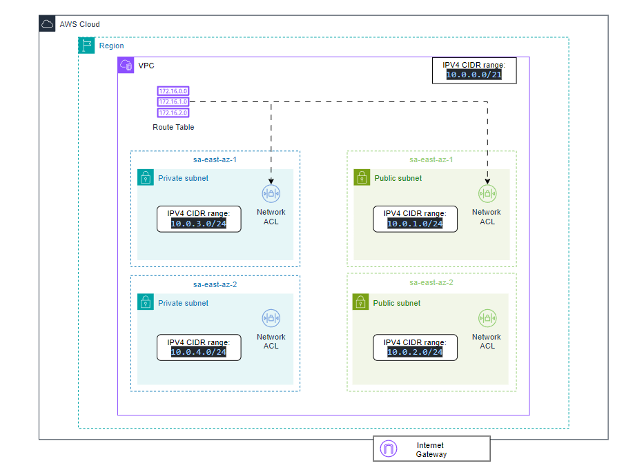
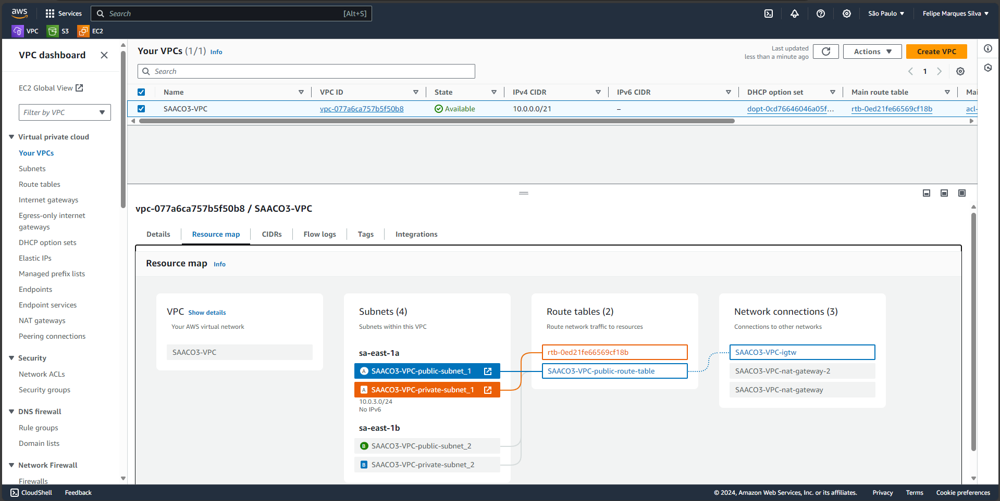

# Terraform AWS VPC Infrastructure

# EN-US 🇬🇧

This project uses Terraform to create a Virtual Private Cloud (VPC) infrastructure in AWS, including VPC, subnets, route tables, internet gateway, NAT gateways, and security groups. A complete ecosystem to secure and manage public and private resources in the cloud.

This infrastructure setup is ideal for simple websites that require a private integration with backend applications (hosted on EC2/ECS instances) and other AWS services such as queues, databases, and more with multi a-z subnets to ensure network availability.

- Terraform version= ">=1.6.0"
- AWS Provider version= "~>5.0"

## Architecture

The architecture consists of:

- A VPC with a specified CIDR block.
- Two sets of subnets: public and private, each with their own CIDR blocks.
- Route tables, one for the public subnets and another for the private subnets.
- An internet gateway attached to the VPC.
- NAT gateways in each public subnet, used for outbound internet access for private subnets.
- Security groups for controlling inbound and outbound traffic within the VPC.





## Usage

To use this project, follow these steps:

1. Clone the repository.
2. Create a `terraform.tfvars` file with your desired configuration.
3. Configure your GitHub AWS credentials: This project utilizes a GitHub Actions workflow that automates the Terraform lifecycle, including init, fmt, validate, apply, and destroy.

```env:
    AWS_ACCESS_KEY_ID: ${{ secrets.AWS_ACCESS_KEY_ID }}
    AWS_SECRET_ACCESS_KEY: ${{ secrets.AWS_SECRET_ACCESS_KEY }}
    TF_VAR_aws_key_pub: ${{ secrets.TF_VAR_aws_key_pub }}
```
Note: To disable the automatic destruction of your cloud resources, comment out the following line in the workflow file `1-push-deploy-infra.yml`:

```
terraform destroy -auto-approve
```

4. Push your branch: Once you've configured everything, push your branch and monitor the process through GitHub Actions.

## Configuration

You can customize the configuration by modifying the `terraform.tfvars` file. Here are the available variables:

```hcl
cidr_block = "10.0.0.0/16"
vpc_name = "my-vpc"
tag_owner = "your-name"

public_subnets_cidr_blocks = [
  "10.0.1.0/24",
  "10.0.2.0/24",
  "10.0.3.0/24",
]

private_subnets_cidr_blocks = [
  "10.0.101.0/24",
  "10.0.102.0/24",
  "10.0.103.0/24",
]

rt_cidr_block = "0.0.0.0/0"
region_number = 1
az_number = 3
```

## Outputs

The following outputs will be displayed after running `terraform apply`:

- `vpc_id`: The ID of the created VPC.
- `public_subnet_ids`: A list of IDs of the public subnets.
- `private_subnet_ids`: A list of IDs of the private subnets.
- `igtw_id`: The ID of the internet gateway.
- `nat_gateway_ids`: A list of IDs of the NAT gateways.

## References

- [Terraform AWS Provider Documentation](https://registry.terraform.io/providers/hashicorp/aws/latest/docs)
- [AWS VPC Documentation](https://docs.aws.amazon.com/vpc/latest/userguide/VPC_Introduction.html)

## Contributing

Pull requests are welcome. For major changes, please open an issue first to discuss what you would like to change.

Please make sure to update tests as appropriate.


# PT-BR 🇧🇷

Este projeto utiliza Terraform para criar uma infraestrutura de Virtual Private Cloud (VPC) na AWS, incluindo VPC, sub-redes, tabelas de rotas, internet gateway, NAT gateways e grupos de segurança. Um ecossistema completo para proteger e gerenciar recursos públicos e privados na nuvem.

Essa configuração de infraestrutura é ideal para sites simples que requerem integração privada com aplicativos de backend (hospedados em instâncias EC2/ECS) e outros serviços AWS, como filas, bancos de dados e mais, com sub-redes multi AZ para garantir a disponibilidade da rede.

- Terraform version= ">=1.6.0"
- AWS Provider version= "~>5.0"

## Arquitetura

A arquitetura consiste em:

- Uma VPC com um bloco CIDR especificado.
- Dois conjuntos de sub-redes: públicas e privadas, cada uma com seus próprios blocos CIDR.
- Tabelas de rotas, uma para as sub-redes públicas e outra para as sub-redes privadas.
- Um internet gateway anexado à VPC.
- NAT gateways em cada sub-rede pública, usados para acesso à internet de saída para sub-redes privadas.
- Grupos de segurança para controlar o tráfego de entrada e saída dentro da VPC.


## Uso

Para utilizar este projeto, siga os seguintes passos:

1. Clone o repositório.
2. Crie um arquivo `terraform.tfvars` com a configuração desejada.
3. Configure suas credenciais AWS no GitHub: Este projeto utiliza um fluxo de trabalho do GitHub Actions que automatiza o ciclo de vida do Terraform, incluindo `init`, `fmt`, `validate`, `apply` e `destroy`.

```env:
    AWS_ACCESS_KEY_ID: ${{ secrets.AWS_ACCESS_KEY_ID }}
    AWS_SECRET_ACCESS_KEY: ${{ secrets.AWS_SECRET_ACCESS_KEY }}
    TF_VAR_aws_key_pub: ${{ secrets.TF_VAR_aws_key_pub }}
```

Observação: Para desativar a destruição automática dos seus recursos na nuvem, comente a seguinte linha no arquivo de fluxo de trabalho `1-push-deploy-infra.yml`:


```
terraform destroy -auto-approve
```

4. Envie sua branch: Depois de configurar tudo, envie sua branch e monitore o processo através do GitHub Actions.
Configuração
Você pode personalizar a configuração modificando o arquivo terraform.tfvars. Aqui estão as variáveis disponíveis:

```hcl
cidr_block = "10.0.0.0/16"
vpc_name = "my-vpc"
tag_owner = "your-name"

public_subnets_cidr_blocks = [
  "10.0.1.0/24",
  "10.0.2.0/24",
  "10.0.3.0/24",
]

private_subnets_cidr_blocks = [
  "10.0.101.0/24",
  "10.0.102.0/24",
  "10.0.103.0/24",
]

rt_cidr_block = "0.0.0.0/0"
region_number = 1
az_number = 3
```

## Saídas

As seguintes saídas serão exibidas após executar `terraform apply`:

- vpc_id: O ID da VPC criada.
- public_subnet_ids: Uma lista de IDs das sub-redes públicas.
- private_subnet_ids: Uma lista de IDs das sub-redes privadas.
- igtw_id: O ID do internet gateway.
- nat_gateway_ids: Uma lista de IDs dos NAT gateways.

## Referências

- [Terraform AWS Provider Documentation](https://registry.terraform.io/providers/hashicorp/aws/latest/docs)
- [AWS VPC Documentation](https://docs.aws.amazon.com/vpc/latest/userguide/VPC_Introduction.html)

## Contribuindo

Pull requests são bem-vindos. Para mudanças significativas, por favor, abra uma issue primeiro para discutir o que você gostaria de alterar.

Por favor, certifique-se de atualizar os testes conforme necessário.
